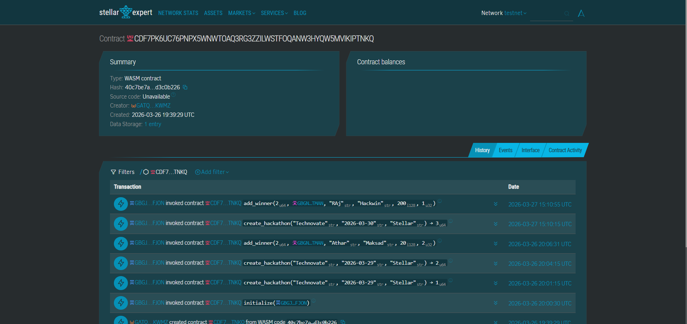
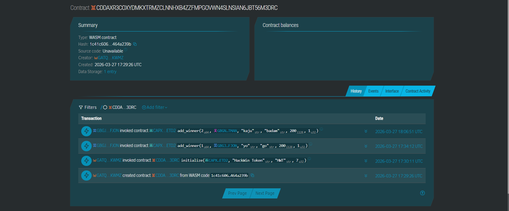
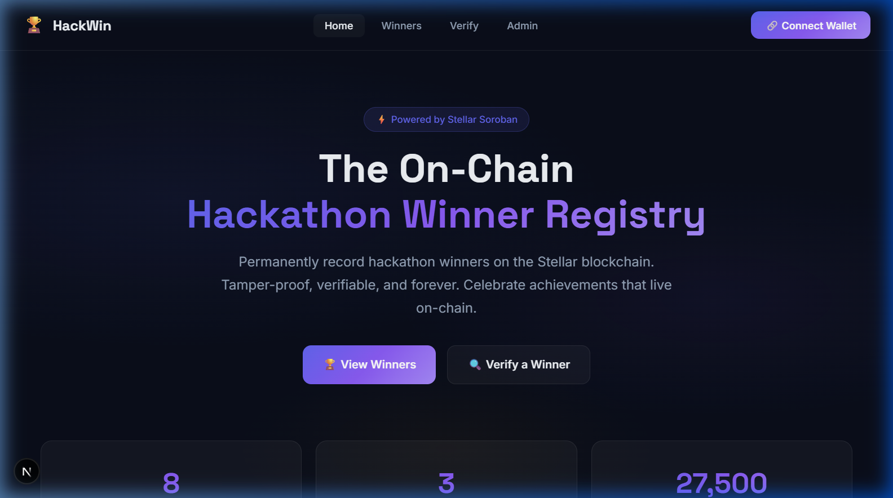
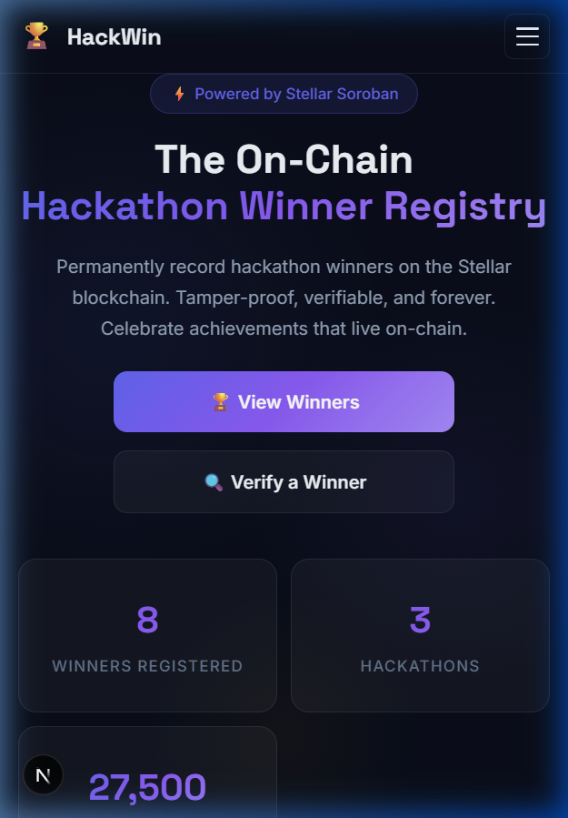

# HackWin 🏆
 

## Project Description
HackWin is a decentralized Hackathon Winner Registry built on the Stellar blockchain. It permanently records hackathon winners on-chain using Soroban smart contracts — tamper-proof, verifiable, and forever accessible through a modern web interface.

## Project Vision
HackWin makes hackathon achievements trustworthy and permanent by:

- storing winner records immutably on Stellar through smart contracts,
- enabling anyone to verify a winner's credentials with just a wallet address, and
- providing a sleek, responsive glassmorphism UI that makes on-chain data accessible.

## Key Features
- On-chain hackathon winner registry powered by Soroban smart contracts
- **Inter-contract calls** — HackathonRegistry automatically mints HWT prize tokens to winners
- **Custom HWT Token** — dedicated token contract for prize rewards
- Public winner verification by Stellar wallet address
- Admin dashboard for creating hackathons and registering winners
- Real-time stats dashboard (total winners, hackathons, XLM awarded)
- Freighter wallet integration for signing transactions
- Hybrid mode — works with deployed contract or localStorage demo mode
- Responsive glassmorphism UI with dark theme and animations

## How It Works
1. **Connect Wallet:** Admin connects their Freighter wallet on the Stellar testnet.
2. **Create Hackathon:** Register a hackathon event (name, date, organizer) — stored on-chain.
3. **Add Winners:** Record winners with wallet address, project name, rank, and prize in XLM.
4. **Auto Token Reward:** The registry contract makes an **inter-contract call** to the HWT token contract to mint prize tokens directly to the winner's wallet.
5. **Verify Anytime:** Anyone can verify a winner by pasting their Stellar wallet address.

## Deployed Smart Contract Details

### Contract IDs and Transaction Hashes
| Contract           | Address / Contract ID                                      | Deployment Tx Hash |
|--------------------|------------------------------------------------------------|--------------------|
| HackathonRegistry  | `CDF7PK6UC76PNPX5WNWTOAQ3RG3ZZILWSTFOQANW3HYQW5MVIKIPTNKQ` | `<ADD_DEPLOY_TX_HASH>` |
| HackWinToken (HWT) | `<ADD_TOKEN_CONTRACT_ID>`                                   | `<ADD_TOKEN_DEPLOY_TX_HASH>` |

### Token / Pool Address
| Item | Value |
|------|-------|
| Token Address | `<ADD_TOKEN_CONTRACT_ID>` |
| Initialize Tx Hash | `<ADD_TOKEN_INIT_TX_HASH>` |

### Block Explorer Screenshots

- HackathonRegistry Explorer Screenshot: 
- HackWinToken Explorer Screenshot: 


## UI Screenshots

### Home / Dashboard Screen:


### Mobile View:


## Demo Link
https://hackwin.vercel.app

## CI/CD Status
- **Workflow:** HackWin CI/CD at `.github/workflows/ci.yml`
- **GitHub Actions:** https://github.com/rajkumarsharma316/HackWin/actions/workflows/ci.yml
- **Badge:** 

## Project Setup Guide

### Prerequisites
- Node.js 18+ and npm
- Rust toolchain with `wasm32-unknown-unknown` target
- Soroban CLI
- [Freighter Wallet](https://freighter.app/) browser extension

### Steps

1. **Clone the repository:**
   ```bash
   git clone https://github.com/rajkumarsharma316/HackWin.git
   cd HackWin
   ```

2. **Install frontend dependencies:**
   ```bash
   cd frontend
   npm install
   ```

3. **Start the frontend:**
   ```bash
   npm run dev
   ```

4. **Build contracts (from repo root):**
   ```bash
   cd hackathon-registry
   rustup target add wasm32-unknown-unknown
   cargo build --target wasm32-unknown-unknown --release -p hackwin-token
   cargo build --target wasm32-unknown-unknown --release -p hackathon-registry
   ```

5. **Deploy contracts to Stellar testnet:**
   ```bash
   stellar keys generate --global deployer --network testnet

   # Deploy token contract first
   stellar contract deploy \
     --wasm target/wasm32-unknown-unknown/release/hackwin_token.wasm \
     --source deployer \
     --network testnet

   # Deploy registry contract
   stellar contract deploy \
     --wasm target/wasm32-unknown-unknown/release/hackathon_registry.wasm \
     --source deployer \
     --network testnet

   # Initialize token
   stellar contract invoke \
     --id <TOKEN_CONTRACT_ID> \
     --source deployer \
     --network testnet \
     -- initialize --admin <YOUR_WALLET> --name "HackWin Token" --symbol "HWT" --decimals 7

   # Initialize registry with token contract reference
   stellar contract invoke \
     --id <REGISTRY_CONTRACT_ID> \
     --source deployer \
     --network testnet \
     -- initialize --admin <YOUR_WALLET> --token_contract <TOKEN_CONTRACT_ID>
   ```

## Testing
Run the smart contract test suite:

```bash
cd hackathon-registry
cargo test
```

Tests cover:
- ✅ Token initialization and metadata
- ✅ Token minting and balance tracking
- ✅ Token transfer and allowance mechanics
- ✅ Hackathon creation and winner registration
- ✅ **Inter-contract calls** — registry minting tokens to winners
- ✅ Multiple winners receiving correct token amounts
- ✅ Global stats validation

## Architecture

```
┌─────────────────────────────────────────────────┐
│              USER (Freighter Wallet)            │
└────────────────────┬────────────────────────────┘
                     ▼
┌─────────────────────────────────────────────────┐
│          Next.js Frontend (React 19)            │
│   Home · Admin · Verify · Winners               │
│   contract.ts (Soroban ↔ localStorage)          │
└────────────────────┬────────────────────────────┘
                     │ Soroban RPC
                     ▼
┌─────────────────────────────────────────────────┐
│     HackathonRegistry Contract (Rust)           │
│     • create_hackathon()  • add_winner()        │
│     • verify_winner()     • get_stats()         │
│              │                                  │
│              │ INTER-CONTRACT CALL              │
│              ▼                                  │
│     HackWinToken Contract (HWT)                 │
│     • mint()  • transfer()  • balance()         │
│              Stellar Testnet                    │
└─────────────────────────────────────────────────┘
```

## Tech Stack
- **Soroban Smart Contracts** (Rust)
- **React 19 + Next.js 16**
- **Stellar SDK + Freighter API**
- **CSS** (Glassmorphism Design System)
- **GitHub Actions** (CI/CD)
- **Vercel** (Hosting)

## Future Scope
- Multi-admin support with role-based access
- On-chain certificate NFT minting for winners
- Mainnet deployment
- Winner profile pages with project links
- IPFS integration for project documentation

## License
MIT
